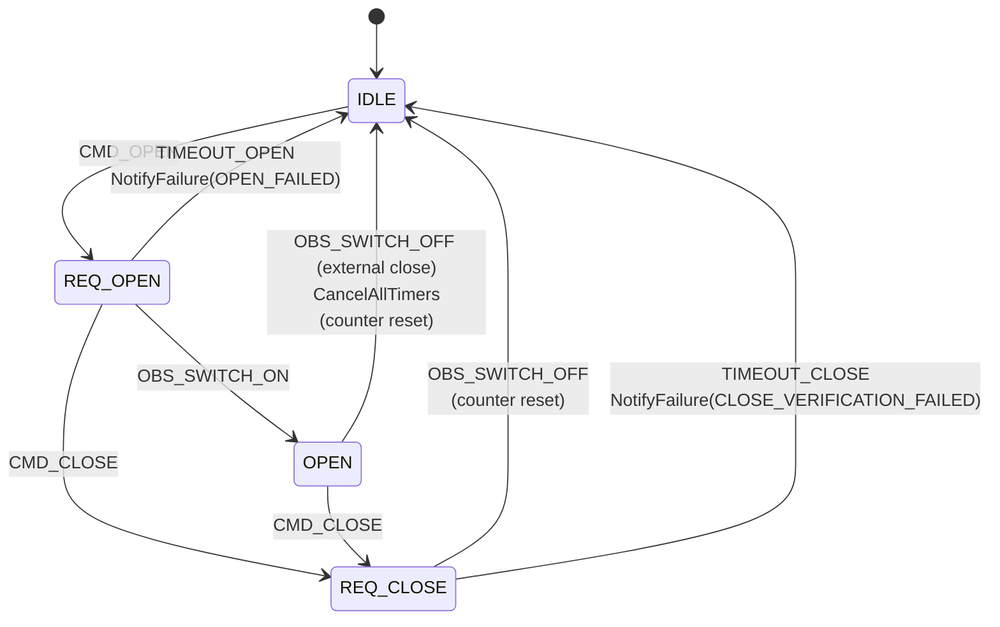

# Valve State Machine

Per-valve finite state machine that drives every irrigation action.
Implementation: `custom_components/never_dry/valve_fsm.py`.

The FSM is **pure Python** — no Home Assistant dependency. It accepts events,
returns a `TransitionResult` describing the new state and a list of
*actions* (data, not side effects). The HA-aware host
(`valve_operator.py`) executes those actions: switch commands,
asyncio timers, notifications.

## Why a state machine

Before the FSM the controller tracked irrigation with a single global
`_running` flag and a `_active_valve` string. That model:

- Couldn't represent two valves in different lifecycle phases at the same time.
- Coupled the irrigation orchestrator to the failure-detection logic.
- Made it impossible to reason about "switch confirmed but no flow" or
  "switch off but flow still positive" as first-class outcomes.
- Lost state across HA restarts.

The FSM gives every valve its own state, its own timers and its own
failure counter. Verification is staged: L2 = switch state confirmed,
L3 = water actually flowing. Failures map to typed `FailureKind` values
that the host can surface to the user via deduplicated notifications.

## States

| State | Meaning |
|---|---|
| `IDLE` | No operation in flight. |
| `REQ_OPEN` | `switch.turn_on` issued, waiting for state confirmation. |
| `OPEN` | Switch reported `on`. With flow meter: waiting for flow > 0. |
| `OPEN_VERIFIED` | Flow confirmed (flow-meter path only). |
| `REQ_CLOSE` | `switch.turn_off` issued, waiting for state confirmation. |
| `CLOSED` | Switch reported `off`. Waiting for flow → 0 (leak window). |
| `UNREACHABLE` | HA entity went `unavailable`. All timers cancelled. |
| `MAINTENANCE` | N consecutive failures — locked until `CMD_RESET`. |

`OPEN_VERIFIED` and `CLOSED` exist only when a flow meter is configured.
Without one, `REQ_OPEN` goes straight to `OPEN` and `REQ_CLOSE` goes
straight back to `IDLE`.

## Diagram — with flow meter

```mermaid
stateDiagram-v2
    [*] --> IDLE

    IDLE --> REQ_OPEN: CMD_OPEN<br/>SendSwitchOn<br/>StartTimer(open)

    REQ_OPEN --> OPEN: OBS_SWITCH_ON<br/>CancelTimer(open)<br/>StartTimer(flow)
    REQ_OPEN --> IDLE: TIMEOUT_OPEN<br/>NotifyFailure(OPEN_FAILED)
    REQ_OPEN --> REQ_CLOSE: CMD_CLOSE (emergency)<br/>CancelTimer(open)<br/>SendSwitchOff<br/>StartTimer(close)

    OPEN --> OPEN_VERIFIED: OBS_FLOW_POSITIVE<br/>CancelTimer(flow)
    OPEN --> IDLE: TIMEOUT_FLOW<br/>SendSwitchOff<br/>NotifyFailure(ACTUATION_FAILED)
    OPEN --> REQ_CLOSE: CMD_CLOSE<br/>CancelTimer(flow)<br/>SendSwitchOff<br/>StartTimer(close)
    OPEN --> IDLE: OBS_SWITCH_OFF (external close)<br/>CancelAllTimers<br/>(counter reset)

    OPEN_VERIFIED --> REQ_CLOSE: CMD_CLOSE<br/>SendSwitchOff<br/>StartTimer(close)
    OPEN_VERIFIED --> IDLE: OBS_SWITCH_OFF (external close)<br/>CancelAllTimers<br/>(counter reset)

    REQ_CLOSE --> CLOSED: OBS_SWITCH_OFF<br/>CancelTimer(close)<br/>StartTimer(leak)
    REQ_CLOSE --> IDLE: TIMEOUT_CLOSE<br/>NotifyFailure(CLOSE_VERIFICATION_FAILED)

    CLOSED --> IDLE: OBS_FLOW_ZERO<br/>CancelTimer(leak)<br/>(counter reset)
    CLOSED --> IDLE: TIMEOUT_LEAK<br/>NotifyFailure(CLOSE_LEAK)

    note left of UNREACHABLE
        OBS_UNAVAILABLE from any
        active state moves here
        and cancels all timers.
    end note

    IDLE --> UNREACHABLE: OBS_UNAVAILABLE
    REQ_OPEN --> UNREACHABLE: OBS_UNAVAILABLE
    OPEN --> UNREACHABLE: OBS_UNAVAILABLE
    OPEN_VERIFIED --> UNREACHABLE: OBS_UNAVAILABLE
    REQ_CLOSE --> UNREACHABLE: OBS_UNAVAILABLE
    CLOSED --> UNREACHABLE: OBS_UNAVAILABLE

    UNREACHABLE --> IDLE: OBS_AVAILABLE

    MAINTENANCE --> IDLE: CMD_RESET<br/>(counter reset)
```

Any failure transition increments the consecutive-failure counter. When
the counter reaches `max_consecutive_failures` (default **3**) the
target state is `MAINTENANCE` instead of `IDLE`, and an
`EnterMaintenance` action is emitted alongside the `NotifyFailure`.

## Diagram — no flow meter



`OPEN_VERIFIED` and `CLOSED` are unreachable: there is no flow evidence
to wait for and no leak window to honour. `TIMEOUT_FLOW` and
`TIMEOUT_LEAK` are accepted but ignored.

## External / hardware auto-close

Smart valves with an on-device timer — e.g. the **Sonoff SWV**, which
auto-closes after a hardware on-time (~600 s in the field) — turn the
switch `off` without us issuing `CMD_CLOSE`. Previously, an unsolicited
`OBS_SWITCH_OFF` while `OPEN` / `OPEN_VERIFIED` was a **no-op**: the FSM
kept believing the valve was open. A later commanded close then issued
`switch.turn_off` to an already-off switch, so HA produced **no off-transition**
to confirm it, the close timer fired, and the cycle failed with a spurious
`CLOSE_VERIFICATION_FAILED` (observed on the *Giardino Ortensia* zone).

The FSM now treats an unsolicited `OBS_SWITCH_OFF` in `OPEN` / `OPEN_VERIFIED`
as a **clean external close**: it cancels every timer, resets the failure
counter and returns to `IDLE`, so the FSM reflects reality and a subsequent
`CMD_CLOSE` is a no-op that resolves `OK`. This pairs with the controller's
delivery-loop early-exit on the same observation (see
`controller-reliability.md`): without the FSM change, that early-exit would
itself have produced the false `CLOSE_VERIFICATION_FAILED`.

## Failure kinds

| Kind | Condition | Likely cause |
|---|---|---|
| `OPEN_FAILED` | `REQ_OPEN` did not see `OBS_SWITCH_ON` within `open_timeout_s` | Zigbee packet loss, sleepy device |
| `ACTUATION_FAILED` | Switch reported on but flow stayed at zero | Water shut off upstream, stuck/calcified valve, broken flow sensor |
| `CLOSE_VERIFICATION_FAILED` | `REQ_CLOSE` did not see `OBS_SWITCH_OFF` within `close_timeout_s` | Zigbee packet loss |
| `CLOSE_LEAK` | Switch reported off but flow stayed positive | Valve mechanically stuck open — most dangerous mode |

## Timeouts and counters

| Setting | Default | Notes |
|---|---|---|
| `open_timeout_s` | 10.0 | `REQ_OPEN` → `OBS_SWITCH_ON` |
| `flow_verify_timeout_s` | 10.0 | `OPEN` → `OBS_FLOW_POSITIVE` (flow meter only) |
| `close_timeout_s` | 10.0 | `REQ_CLOSE` → `OBS_SWITCH_OFF` |
| `leak_timeout_s` | 10.0 | `CLOSED` → `OBS_FLOW_ZERO` (flow meter only) |
| `max_consecutive_failures` | 3 | Threshold for entering `MAINTENANCE` |

A clean cycle resets the counter:
- With flow meter: `CLOSED` → `IDLE` via `OBS_FLOW_ZERO`.
- Without flow meter: `REQ_CLOSE` → `IDLE` via `OBS_SWITCH_OFF`.
- External/hardware close: `OPEN` / `OPEN_VERIFIED` → `IDLE` via `OBS_SWITCH_OFF`.

## Actions

`dispatch` returns a `tuple[FsmAction, ...]` instead of executing them.
This keeps the FSM pure and the unit tests deterministic. The host
must perform these actions in order:

| Action | Host responsibility |
|---|---|
| `SendSwitchOn` / `SendSwitchOff` | `await hass.services.async_call("switch", "turn_on"/"turn_off", ...)` |
| `StartTimer(name, seconds)` | Schedule an asyncio task that dispatches `TIMEOUT_<name>` after `seconds`. Cancel any previous timer with the same name. |
| `CancelTimer(name)` | Cancel the asyncio task associated with `name`. |
| `CancelAllTimers` | Cancel every active timer for this valve (used on entering `UNREACHABLE`). |
| `NotifyFailure(kind)` | Surface the failure to the user (unified notifier; for now `_LOGGER.error`). |
| `EnterMaintenance` | Mark the valve as needing manual intervention (entity attribute / persistent notification). |

## Host integration: `ValveOperator`

`valve_operator.py` is the HA-aware wrapper that drives the FSM in
production. One operator per configured valve. It:

- Subscribes to `state_changed` events for the switch entity and, if
  present, the flow sensor; translates them into `OBS_*` FSM events.
- Executes every `FsmAction` returned by `dispatch`: switch services
  via `hass.services.async_call("switch", ...)`, asyncio tasks for
  `StartTimer`, error logs for `NotifyFailure` (to be replaced with the
  unified notifier).
- Exposes `async open()` and `async close()` that await the appropriate
  terminal state and return a typed `OperationResult` with `status`,
  `error_detail`, `retries_used`, `duration_ms`.

### Retry policy

The operator retries **transient (communications) failures** with
exponential backoff up to `max_retries` (default 2, total 3 attempts).
Physical failures are surfaced immediately:

| Failure | Retry? | Why |
|---|---|---|
| `OPEN_FAILED` | ✓ | Likely Zigbee packet loss / sleepy device — second try often lands |
| `CLOSE_VERIFICATION_FAILED` | ✓ | Same comms class |
| `ACTUATION_FAILED` | ✗ | Hydraulic / mechanical issue — retry cannot unblock it |
| `CLOSE_LEAK` | ✗ | Stuck-open valve — retry wastes water during the second close attempt |

Default backoff: `(1.0s, 2.0s, 4.0s)` — exponential, indexed by retry
number. `flow_zero_threshold` defaults to `0.05` (unit depends on the
flow sensor; the controller will pass a unit-aware value).

### Pre-checks

Before dispatching `CMD_OPEN`/`CMD_CLOSE` the operator reads the
switch entity state. Missing entity → `PRECHECK_FAILED("switch_entity_not_found")`;
`unavailable`/`unknown` → `PRECHECK_FAILED("switch_unavailable")`. Operator
in `MAINTENANCE` → `MAINTENANCE("in_maintenance")`. None of these touch
HA services.

## Emergency stop

`CMD_CLOSE` is accepted in **every** active state, not just
`OPEN_VERIFIED`:

- In `REQ_OPEN`: cancel the open timer, send `switch.turn_off`, start
  the close timer.
- In `OPEN` (flow meter): cancel the flow timer, send `switch.turn_off`,
  start the close timer.
- In `OPEN`/`OPEN_VERIFIED` otherwise: send `switch.turn_off`, start
  the close timer.

This guarantees that `never_dry.stop` can interrupt any in-flight
operation cleanly.

## CLOSE_LEAK recovery and escalation

`CLOSE_LEAK` is the most dangerous failure mode the operator can see:
the switch reports off but water is still flowing. The operator runs a
**last-resort recovery** before declaring the close failed:

1. **Direct retry**. After the FSM returns ``CLOSE_LEAK``, the operator
   re-issues ``switch.turn_off`` outside the FSM. Some Zigbee meshes
   simply drop the first off-command; the second one often lands.
2. **Verification**. The operator waits ``leak_timeout_s`` and reads
   the flow sensor. If flow ≤ ``flow_zero_threshold``, the close is
   reclassified as ``OK`` with ``error_detail="leak_recovered"``.
3. **Escalation** (if the leak persists):
   - call the integration's ``never_dry.stop`` service to close every
     other valve preventively;
   - emit a CRITICAL ``STUCK_OPEN`` notification with explicit
     instructions to shut off the mains water valve.

Recovery is attempted **at most once per ``close()`` call** (tracked by
the operator's ``_leak_recovery_attempted`` flag, reset at the start of
every close). It runs outside the FSM, so no spurious transitions are
generated; the FSM is already back in ``IDLE`` (or ``MAINTENANCE``)
when the recovery fires.

**Notification sequencing:** `_notify_failure(CLOSE_LEAK)` does
**not** send a CRITICAL notification. This is intentional: the FSM fires
`NotifyFailure(CLOSE_LEAK)` at the moment the leak timeout expires,
before recovery has been attempted. Sending CRITICAL at that point would
cause a false alarm on every recovery that succeeds. Only
`_escalate_stuck_open()` — called exclusively when recovery fails — sends
the CRITICAL. If recovery succeeds, the user sees nothing beyond the
WARNING/ERROR in the activity log (`CLOSE_LEAK detected → recovery
succeeded`). Do not add CRITICAL logic back to `_notify_failure` for
`CLOSE_LEAK` without re-examining this sequence.

## `volume_preset` delivery mode — operator bypass *(deliberate)*

`volume_preset` is the mode for **smart self-piloting valves** such as
the Sonoff SWV: they accept a "dose" target on a `number` entity and
close themselves once that volume has been dispensed. They are not
"dumb" relay-driven switches that need to be told ``turn_on`` and then
``turn_off`` after a measured interval.

These valves **do not fit the FSM** for a simple reason: the
``OPEN_VERIFIED → OBS_SWITCH_OFF`` transition has no destination in
the state machine — the FSM was designed around "the host commands a
close, then observes one". A self-closing valve generates the same
observation without a matching command, which the FSM cannot
distinguish from a stuck-shut firmware fault.

Two design choices follow from that:

1. `volume_preset` calls bypass `ValveOperator` entirely. All switch
   operations are direct `hass.services.async_call(...)`. The price is
   no leak detection and no actuation verification for this mode —
   acceptable, because the smart valve provides its own metering.
2. To make `volume_preset` actually deliver water, the valve-FSM work
   also fixed a pre-existing bug: the previous code only sent
   `number.set_value` and waited for the valve to close itself —
   but never opened it. Some smart-valve firmwares do auto-open on
   `set_value`, many do not. The new sequence is:
     1. `number.set_value(volume)` — arm the dose.
     2. Wait `AUTO_OPEN_GRACE_S` (3 s) for the valve to auto-open.
     3. If still closed after the grace window, send `switch.turn_on`
        — idempotent if the valve already opened in the gap.
     4. Poll for `state == "off"` (self-close) or controller timeout.

   This pattern works for both flavours of smart valve with no
   user-visible configuration knob.

## Testing

`tests/test_valve_fsm.py` covers the FSM with 25 deterministic
unit tests: happy paths (with and without flow meter), every failure
kind, counter reset, `MAINTENANCE` entry and reset, `UNREACHABLE`
recovery, emergency close from each active state, out-of-place events
treated as no-ops. The FSM has no async, no clock, no HA imports — the
test file can be run in isolation.

---

## Revision history

| Date | Change |
|---|---|
| 2026-06 | Initial — per-valve FSM and operator documentation. |
