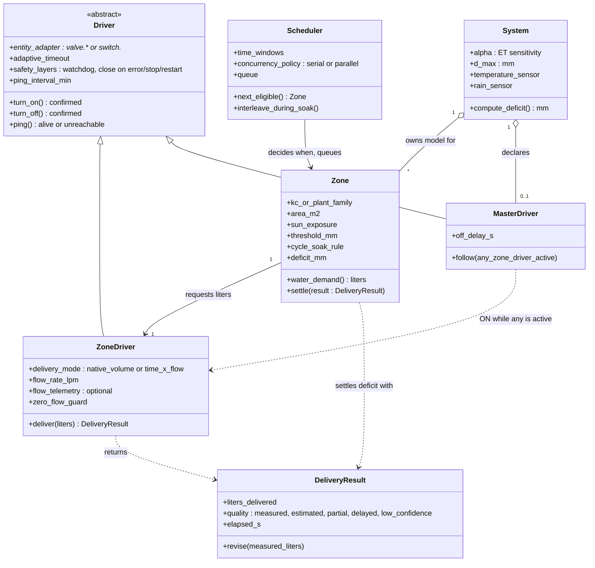

# Design — Domain Object Model

**Status:** Draft
**Date:** 2026-07-05 (updated 2026-07-06 with review feedback from GH #74)
**Related:** GH #74 (actuator abstraction discussion), GH #94 (`valve.*` support), GH #95 (master valve/pump)

## Purpose

Define the conceptual objects of NeverDry's irrigation domain, independent of the current
module layout. This model guides where new features belong (e.g. "does the master valve go
in the scheduler or in the system?") and what should become an explicit first-class object
as the codebase evolves. For the current module/data-flow architecture see
`developer_manual.md` §1.

## The five objects

| Object | Responsibility | Key attributes |
|---|---|---|
| **System** | Global model and shared infrastructure | α (ET sensitivity), D_max, global sensors (temperature, rain), *declares* the master valve/pump |
| **Zone** | Irrigation unit; translates the model into water demand | Kc / plant family, area, sun exposure; cycle & soak rule; translates mm → liters |
| **Scheduler** | The *when* — and the concurrency policy | Time windows, sequences, calendars; serial vs parallel zone runs, interleaving during soak |
| **ZoneDriver** | The *how* — actuation of one zone's water demand | Entity adapter (`valve.*`/`switch.*`), delivery mode (native volume in liters vs time in seconds via flow rate), flow rate, zero-flow guard; returns a **DeliveryResult** |
| **MasterDriver** | Coordination of shared hydraulics (pump / master valve) | ON when any ZoneDriver is active, OFF when none; configurable off-delay; no notion of liters |

ZoneDriver and MasterDriver are two specializations of a common **Driver** base, which owns
what they share: the entity adapter, ON/OFF command with state confirmation, adaptive
latency/timeout, and the safety layers (watchdog, close on error/stop/restart).

## Translation chain

```
System     computes the deficit (mm)            α, D_max, FAO-56 water balance
   │
Zone       translates mm → liters (via area)    applies cycle & soak
   │
ZoneDriver translates liters → actuation        native volume if supported,
   │                                            else seconds via flow rate
Scheduler  decides in which window it happens
```

Liters are the **contract** between Zone and ZoneDriver: the zone always requests liters;
only the driver knows whether to deliver them by volume or by time. This makes the fallback
natural — same request, two actuation strategies.

The contract is a **round trip**: the driver does not just execute "water X liters", it
returns a **DeliveryResult** — the liters actually delivered, stated as truthfully as the
backend allows (see the design decision below).

## Class diagram



Reading keys: liters flow down the association `Zone → ZoneDriver` and truth flows back up as
a `DeliveryResult`; the `Scheduler` never touches drivers — it only decides *which zone when*
(and, with cycle & soak, may interleave another eligible zone during a soak pause);
`MasterDriver` reacts to the aggregate driver activity, it takes no decisions. The liveness
`ping()` lives in the abstract `Driver`, so both specializations inherit it.

## Design decisions

### Master valve/pump: declared in System, executed by a Driver

The master valve is not scheduling logic — it takes no decisions. It reacts to the aggregate
execution state (an OR over zone drivers), with an off-delay to avoid pump cycling during
sequential zone runs. It is shared hydraulic infrastructure, like the global sensors, so its
*configuration* lives at system level (as requested in GH #95: "master entity configurable at
integration level").

Its *execution* however is a Driver: modeling it as a Driver specialization means the safety
layers (never leave the pump running on error/stop/restart) are written once in the base and
inherited — instead of duplicating watchdog and error handling inside "system" as a special
case.

### Cycle & soak: a Zone rule

Cycle/soak parameters depend on soil infiltration rate and zone properties (slope, soil
type), so they are per-zone configuration. The *execution* of the cycles is driver/controller
mechanics, but the rule lives in the Zone.

### DeliveryResult: the driver reports the most truthful delivered value it can

*From the GH #74 review (fpytloun, 2026-07-06).* Estimating delivered liters from expected
flow can diverge badly from reality — a dirty filter reduces the actual flow rate; a backend
like Hydrawise refreshes measured values only periodically, so the true figure may arrive
late. And for some backends, **command acceptance, physical valve state, and final measured
delivery are three distinct moments**, not one.

The driver therefore returns a **DeliveryResult**, not a bare number: delivered liters plus a
**quality qualifier** — `measured`, `estimated`, `partial`, `delayed`, `low-confidence`. Rules:

- The driver always reports the *most truthful* value available for its backend: cumulative
  flow-meter reading first, flow-rate integration second, configured flow × elapsed time as
  the estimated floor, each labeled accordingly.
- A result may be **revised**: a backend that reports measured volume late (e.g. a periodic
  API refresh) first returns an estimated/`delayed` result and corrects the deficit settlement
  when the measured figure lands.
- A `partial` or zero result with the valve confirmed open still **settles the deficit** with
  the best available estimate — the water was physically delivered whether or not it was
  measured (this is the field bug behind the zero-measured-flow timeout: an unmeasured
  session must never leave the deficit untouched and trigger a retry loop).

The Zone consumes the DeliveryResult to settle its deficit; the quality qualifier flows into
diagnostics (session log, `SESSION_RESULT`) so the user can see *how* the figure was obtained.

**Cycle & soak makes delivery self-correcting.** When a zone waters in cycles, the gap
between the liters requested and the most truthful delivered value of one cycle is simply
added to the next cycle's request: an under-delivery (dirty filter, low pressure, partial
result) is **replenished within the same session**, instead of surfacing a day later as
residual deficit. This is a direct synergy between the DeliveryResult contract and the
cycle & soak rule — it requires truthful per-cycle accounting to work.

### Serial vs parallel irrigation: a Scheduler policy

*From the GH #74 review (fpytloun, 2026-07-06) and the shared-resource discussion earlier in
the thread.* Whether two zones may run at the same time is not a property of a zone or a
driver — it is a property of the shared hydraulics (one well, one pipe, one pump) and
therefore a **Scheduler policy**:

- **Serial** (default for shared-resource systems): one zone runs at a time; eligible zones
  queue.
- **Parallel**: zones with independent hydraulics may overlap.
- **Soak interleaving**: soak pauses are schedulable time — while one zone is soaking,
  another eligible zone can run its cycle, then control returns. This keeps total watering
  windows short without violating the one-valve-at-a-time constraint.

The queue/scheduler implementation stays deferred until real demand for parallel zones shows
up (as agreed in GH #74), but the model reserves the concept now so cycle & soak (a Zone
rule) and concurrency (a Scheduler policy) don't get entangled when either lands.

### Driver liveness: an active availability ping, not just passive state

Passive observation of the HA entity is not enough to know a valve is reachable. A WiFi
valve that drops off the network is marked `unavailable` by its integration; a **Zigbee
valve** often is not — availability tracking in Z2M/ZHA is optional or slow for
battery-powered (sleepy) end devices, so the entity can keep showing a stale `off` for hours
after the device is gone. Discovering that at irrigation time is too late.

The Driver base therefore owns an **active liveness probe**: every *N* minutes (configurable)
it verifies the device is actually reachable, using the cheapest backend-appropriate means —
an attribute read / availability-topic check for Zigbee (MQTT), the entity's own
availability for backends that report it honestly. Probe outcomes feed the existing
machinery rather than inventing a new one: a failed probe drives the FSM `unreachable` state
and the `UNREACHABLE_PASSIVE` / `UNREACHABLE_AT_IRRIGATION` notifications, so the user learns
about a dead valve *before* the next scheduled run, not from a failed one.

## Mapping to current code (2026-07-05)

| Object | Current state |
|---|---|
| System | ✅ explicit: config entry globals, `ETSensor`, `DrynessIndexSensor` |
| Zone | ✅ explicit: `IrrigationZoneSensor`, per-zone config (Kc, area, sun exposure). Cycle & soak: not implemented |
| Scheduler | ⚠️ implicit and minimal: deficit-triggered daily cycle inside `IrrigationController`; no cron/sequences/calendars (deliberately — that is Irrigation Unlimited's territory). Concurrency is de-facto serial, not an explicit policy |
| ZoneDriver | ⚠️ exists but internal: `ValveOperator` (FSM, safety layers, latency tracker) + valve/switch adapter (GH #74/#94); native volume delivery in progress. Delivered liters returned as a bare float — no DeliveryResult qualifier yet |
| MasterDriver | ❌ not implemented (GH #95) |

The refactoring direction is to make the Driver base explicit when implementing GH #95, so
MasterDriver inherits the existing safety layers rather than reimplementing them.
